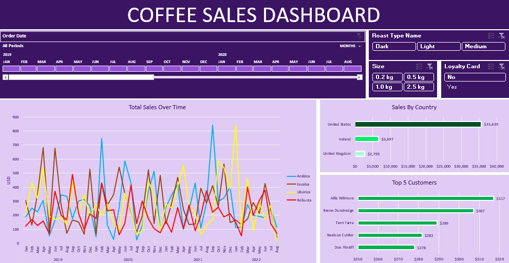

# Coffee Sales Analysis Dashboard ☕📊

## 📌 Project Overview  
This project presents an **interactive Coffee Sales Analysis Dashboard** created in **Microsoft Excel**.  
The dashboard provides a consolidated view of coffee sales performance across different dimensions, helping business stakeholders gain insights into:  

- Revenue trends over time  
- Sales distribution by country, product type, and customer segment  
- Key performance indicators (KPIs) such as total sales, total quantity sold, and average sales value  

The purpose of this project is to **analyze sales data effectively** and present insights in a visually appealing and easy-to-understand format for decision-making.  

---

## 🎯 Objectives  
- Track **monthly and yearly sales performance**  
- Identify **top-performing coffee products**  
- Compare **sales across different countries**  
- Provide a **data-driven dashboard** for quick business insights  

---

## 📂 Project Files  
- `dashboard.png` → Preview of the final Excel Dashboard  
- `Coffee Sales Dashboard.xlsx` (if added) → Interactive Excel file containing the dashboard and raw data  

---

## 🔑 Key Insights  
From the dashboard analysis:  
- **USA contributes the highest sales** among all countries.  
- **Arabica** is the most popular coffee type by sales volume.  
- Sales show a **seasonal trend**, with noticeable spikes during certain months.  
- Customer segments (e.g., Online, Retail, Wholesale) exhibit different purchasing behaviors.  

---

## 🛠 Tools & Techniques Used  
- **Microsoft Excel**  
  - Pivot Tables & Pivot Charts  
  - Slicers for interactivity  
  - Data Cleaning & Transformation  
  - Dashboard Design Principles  

---

## 📊 Dashboard Features  
✔ Interactive filters for **Year, Country, and Product**  
✔ Clear visualization of **sales KPIs**  
✔ Trend analysis with **line & bar charts**  
✔ Customer segment performance breakdown  

---

## 🚀 How to Use  
1. Download the Excel file (if available).  
2. Open in **Microsoft Excel (2016 or later recommended)**.  
3. Use the slicers/filters to explore data across different dimensions.  

---

## 📈 Business Impact  
This dashboard enables coffee retailers and stakeholders to:  
- Monitor performance at a glance  
- Spot growth opportunities  
- Optimize product and market strategies  
- Enhance decision-making with **data-driven insights**  

---

## 🙌 Acknowledgements  
This project was created as part of a **Data Analytics Portfolio Project** to demonstrate Excel dashboarding and sales analysis skills.  
